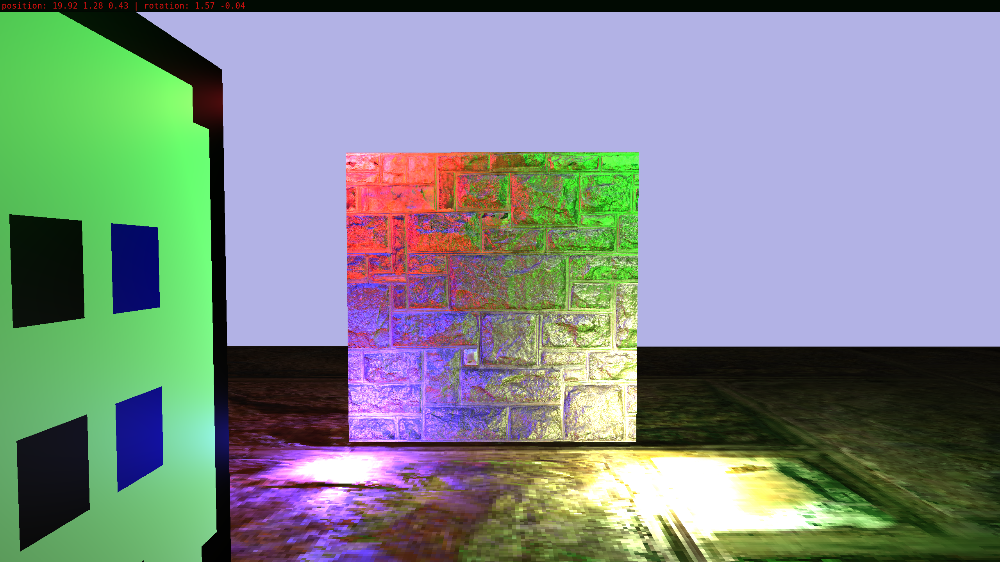

## Курсовая по Компьютерной Графике
2 курс

Демонстрация навыков работы с апи OpenGL.



### Зависимости:
- SDL2
- OpenGL (текущая целевая версия 4.*)
- glew
- glm
- stb_image

### Сброка
Linux:
```shell
make all
```
Windows:
1. Запустить `.\winbuild\app.exe`
2. Из developer command prompt (x64) в папке проекта выполнить:
``` batch
nmake /nologo /f makefile.mak
```
При необходимости поменять переменные в makefile'е на 32-битные и собирать из developer command prompt (x86)

Если каких-то зависимостей не хватает - они либо отсутствуют, либо не найдены.
Поменять пути, компилятор, опции сборки, можно в Makefile.

## Я не читал то, что идёт дальше vvv. Описание работы будет в отчёте

### Готово (\* &ndash; почти):
- Загрузка obj-моделей
- Загрузка материалов\* (в шейдере применяются только основные свойства)
- Освещение (какое-то, пока параметры вписаны напрямую в шейдер)
- Передвижение по трём осям и обзор по двум осям

### TODO:
- Загрузка параметров материала в шейдер
- Шейдер, обрабатывающий материалы (нормали, текстуры, освещение)
- Кнопка и способ перемещения источника света
- Шарик в центра источника света
- Отображение отладочной информации и отрисовка текста
- Физика объектов и игрока
- Отрисовка интерфейса, прозрачные объекты
- Третья лаба
- Четвёртая лаба

### Credits:
- https://polyhaven.com/a/stone_brick_wall_001
